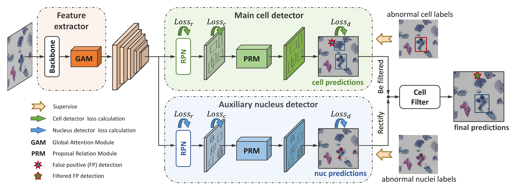
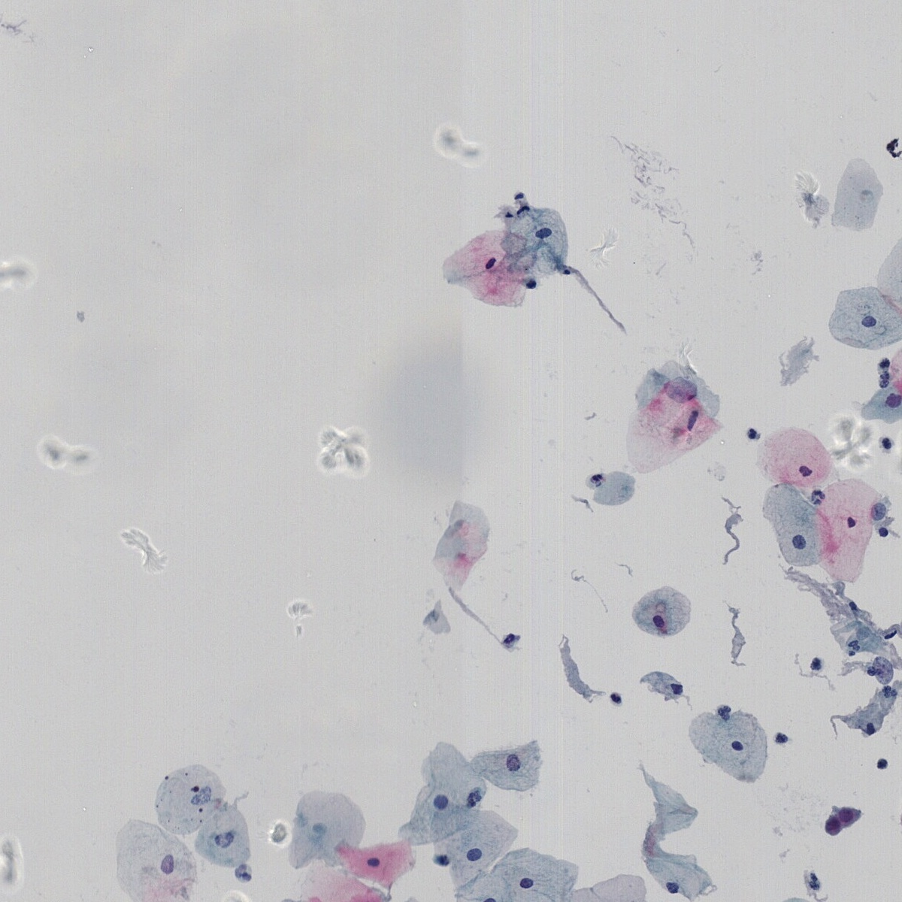
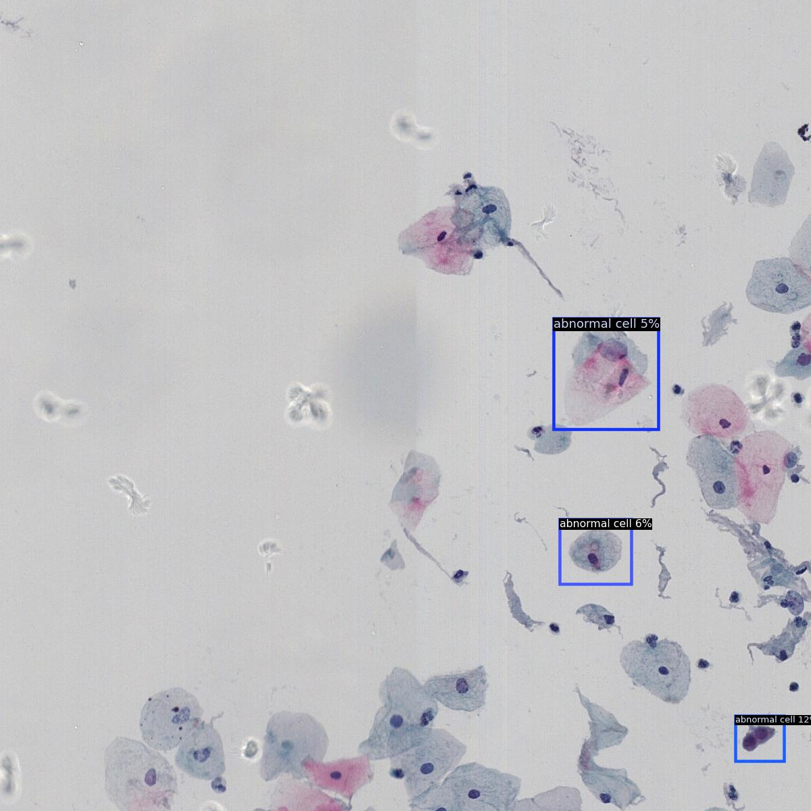
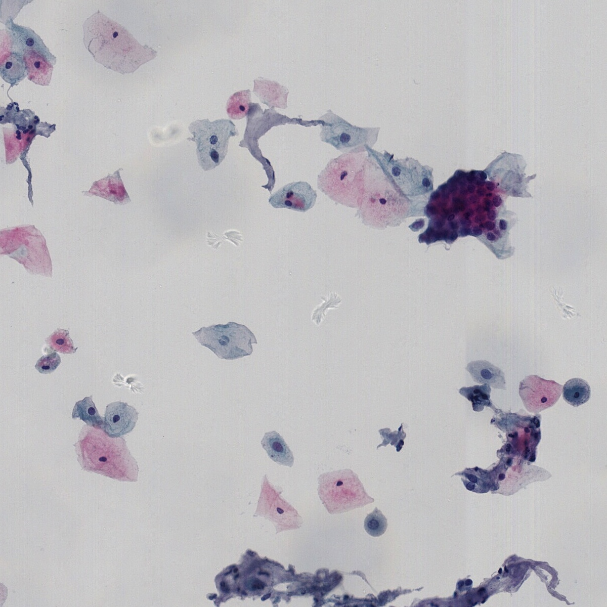
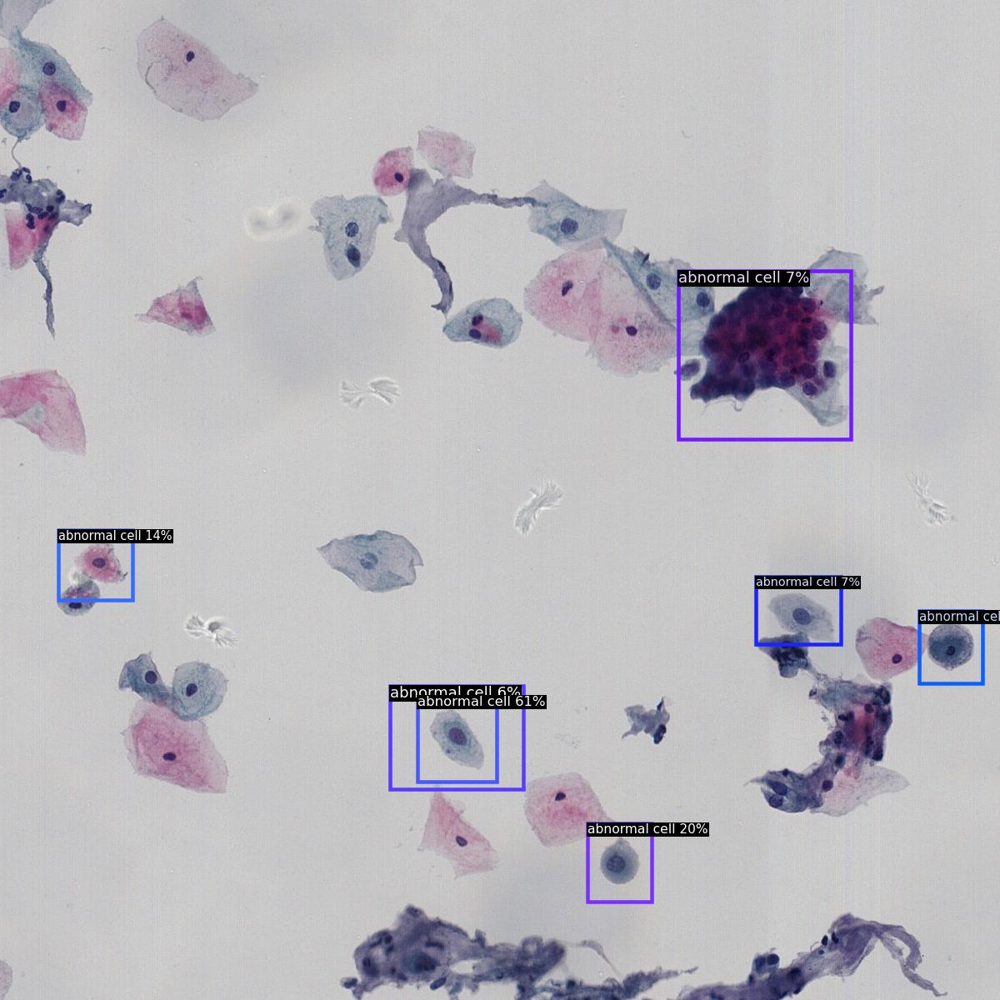
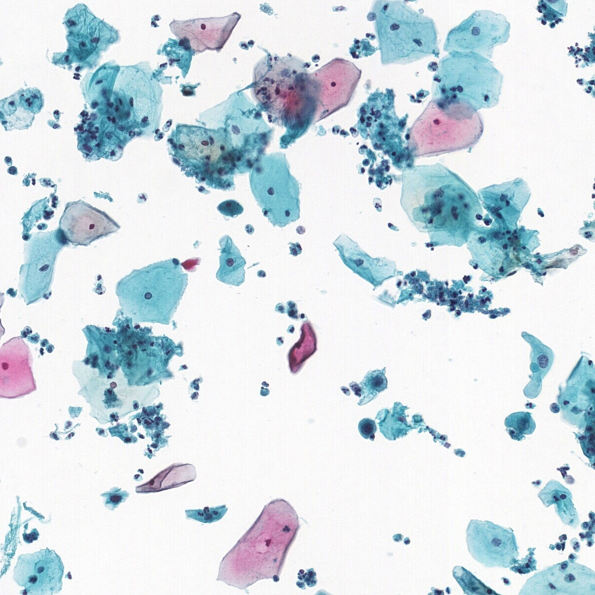
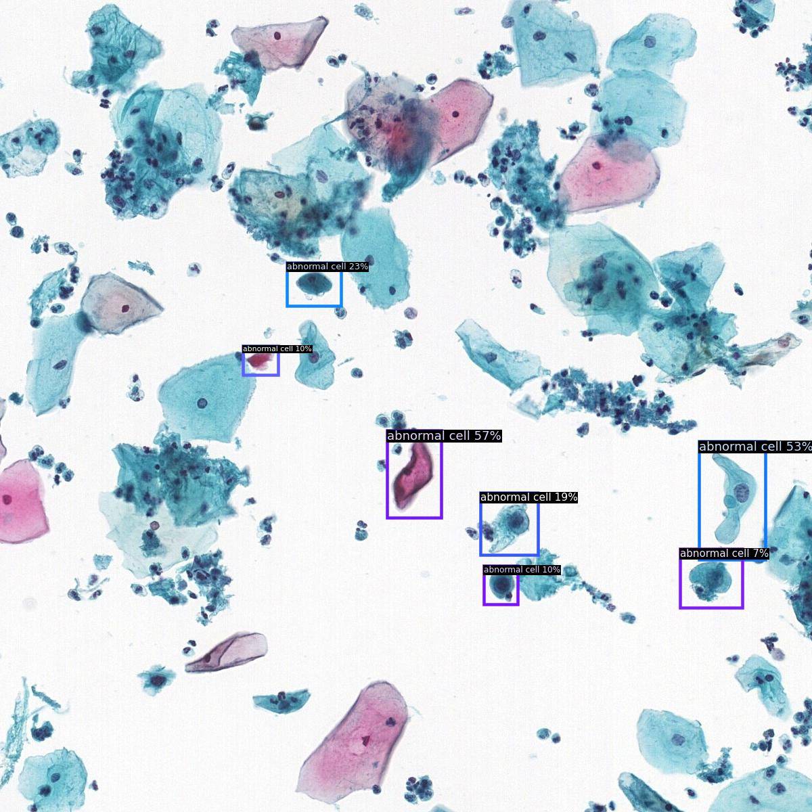
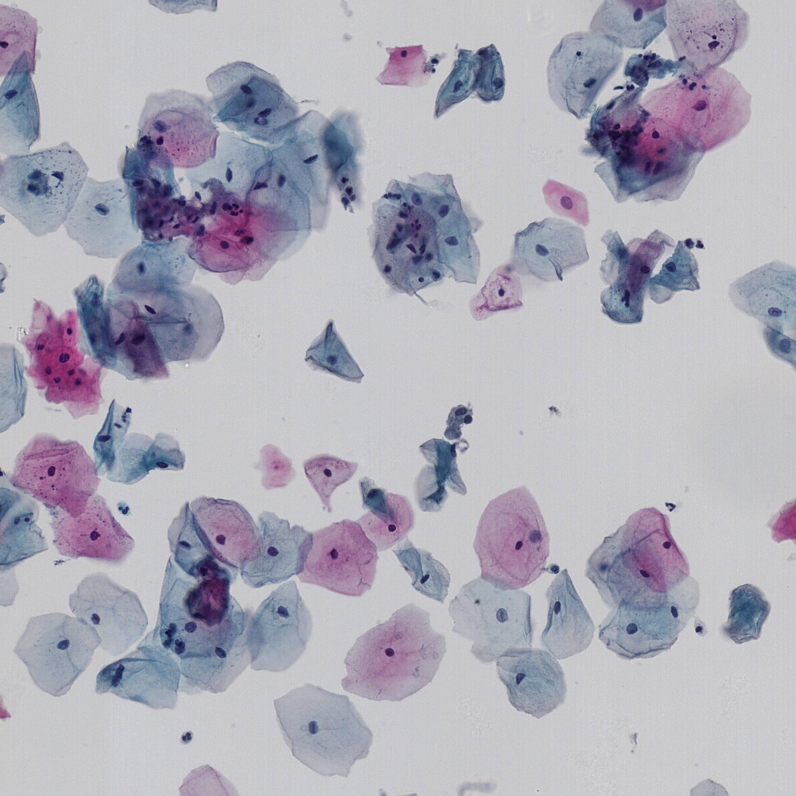
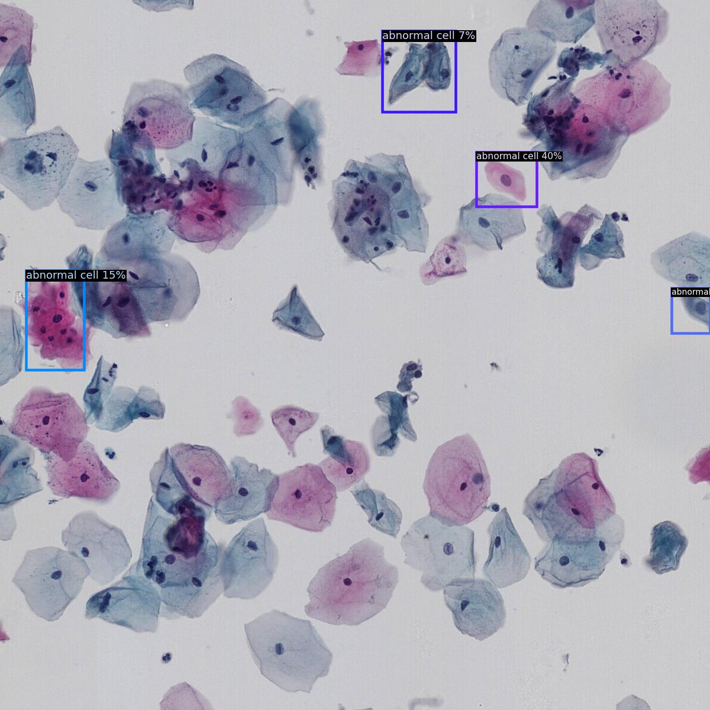

# DPD-Net
Dual-path Proposal Discriminative Network for abnormal cell detection in cervical liquid-based cytology images.

**Framework:**

**Source Code Project:**

--checkpoints:  to save output files (checkpoints, tensorboard, log files, etc.) and pretrained models.

--demo:         input and output images for "demo.py"

--detectron2:   see "https://github.com/facebookresearch/detectron2."

--models:       network architectures of DPD-Net, including backbone (att_fpn.py), RoIHead with Proposal Relation Module (PRM) (relation_roi_heads.py), detection networks (single_cell_rcnn.py, dualway_rcnn.py).

--tools:        files for training, testing, visualizing.

--utils:        calculation of Proposal Contrastive Loss (PCL).

**Demo:**

input images & output images:

  

  

  

  
